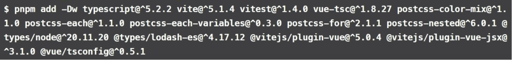

sudo git init
vim .gitignore
mkdir packages
echo -e 'packages:\n - "packages/*"' > pnpm-workspace.yaml

初始化项目
pnpm init
创建目录 
mkdir components core docs hooks theme utils

.
├── components 组件逻辑
├── core npm 包入口
├── docs 文档  
├── hooks 组合式api
├── theme 样式 
└── utils 工具
play

```powershell
for i in components core docs hooks theme utils; do
cd $i
pnpm init
cd ../
done

init.sh

chmod +x init.sh

1. 修改名称 
  "name": "@lily-element/components",
2.安装依赖


```js
"dependencies": {
    "async-validator": "^4.2.5",
    "lodash-es": "^4.17.21",
    "vue": "^3.4.27",
    "lily-element":"workspace:*",
    "@lily-element/components":"workspace:*",
    "@lily-element/hooks":"workspace:*",
    "@lily-element/utils":"workspace:*",
    "@lily-element/theme":"workspace:*"
  },
```
3. components
sudo  pnpm add -D @vue/test-utils@~2.4.5 @vitest/coverage-v8@~1.4.0 jsdom@24.0.0 --filter @lily-element/components


sudo pnpm add @popperjs/core@^2.11.8 --filter @lily-element/components

sudo pnpm add async-validator@^4.2.5 --filter @lily-element/components

touch tsconfig.json
touch tsconfig.node.json
4. utils 功能函数组件注册
import type { App, Plugin, Directive } from "vue";
import { noop } from "lodash-es";

type SFCWithInstall<T> = T & Plugin;


export const withInstall = <T>(component: T) => {
  (component as SFCWithInstall<T>).install = (app: App) => {
    const name = (component as any)?.name || "UnnamedComponent";
    app.component(name, component as SFCWithInstall<T>);
  };
  return component as SFCWithInstall<T>;
};

5. 创建组件
import Button from './Button.vue'
import { withInstall } from '@lily-element/utils'
export const LyButton = withInstall(Button)
Button组件
/**
 * sfc
 * constants
 * styles.css
 * Button.test.tsx
 * types.ts
 */
6.play 
/lily-element/packages/core
index.ts

import components from './components'
import { makeInstaller } from "./makeInstaller"

const installer = makeInstaller(components)
export * from '@lily-element/components'
export default installer

components.ts
import { LyButton } from '@lily-element/components'
import type { Plugin } from 'vue'
export default [LyButton] as Plugin[]


运行 button 实例
main.js
import LilyElement from 'lily-element'
import '@lily-element/theme/index.css'

createApp(App).use(LilyElement).mount('#app')

App.vue
<template>
  <div>
   <LyButton />
  </div>
  <HelloWorld msg="Vite + Vue" />
</template>

7.docs npx vitepress init